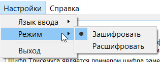

# Инструменты

- Переключение языка определяет какой алфавит будет использоваться для выполнения алгоритма (английский/русский без ё).

.

.

- Переключение режима определяет какой алгоритм будет выполнен (шифровки/расшифровки).

.

.

- Выход закроет приложение.

.

