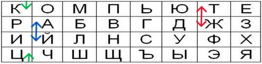
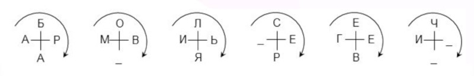

## Шифр Трисемуса

Шифрующие таблицы трисемуса — это метод шифрования, который использует замену символов в тексте на другие символы с помощью специально созданной таблицы.

Шифр Трисемуса является примером шифра замены.

### Принцип работы:

- Для шифрования символа сначала определяется его позиция в таблице.

- Затем символ заменяется символом из другой строки таблицы, находящимся на той же позиции.

## Примеры использования:

- военная связь;

- банковские транзакции;

- коммерческая корреспонденция;

- личная переписка.

_Шифрующая таблица Трисемуса с ключом КОМПЬЮТЕР_

_После шифрования фразы ТАБЛИЦА ТРИСЕМУСА получаем ЖЙЛШЦКЙ ЖИЦЪЗБЫЪЙ_

Расшифровка проводится путём перемещений, обратных тем, что использовались для шифровки.

## Шифр Перекресток

Шифр «Перекресток» — это способ шифрования, при котором для перемешивания букв используются фигуры специального вида.

### Принцип работы:

- Рисуют крестообразные фигуры в количестве, достаточном, чтобы разместить в них все буквы сообщения.

- Открытый текст записывают вокруг этих фигур заранее оговоренным способом, например, по часовой стрелке.

Буквы берутся построчно: вначале берется оговоренное количество букв (N) из первой строки, затем удвоенное количество букв (2N) из второй и снова N букв из третьей строки.(N - ключ, в виде натурального числа)

_Шифр Перекресток для Ф.И.О. АБРАМОВ ИЛЬЯ СЕРГЕЕВИЧ_

_Заменим запятые нижним подчеркиванием_

_После шифрования с ключом 3 получаем БОЛАРМВЬИА_ЯСЕЧ_ЕГЕИ_РВ__

Для расшифровки необходимо записать шифр в три строки длинами N, 2N, и снова N после чего расположить их в ранее оговоренном порядке.

Для более длинных шифров алгоритм необходимо повторить.